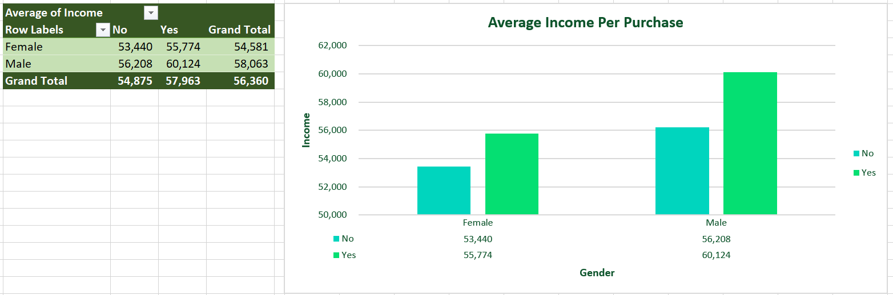
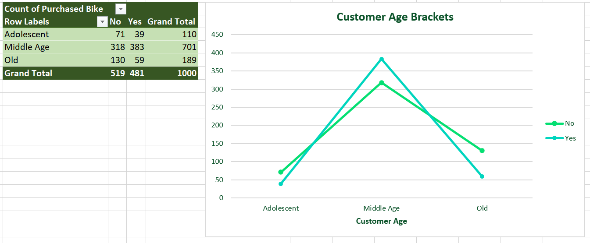

  
Banner <a href="https://www.istockphoto.com/photos/bicycle-for-sale" target="_blank">source</a>


Badge <a href="https://shields.io/" target="_blank">source</a>

# Key Findings: Bike Sales Dataset

1. Data Cleaning and Preparation:

- Duplicates Removal: All duplicate entries were identified and removed to ensure data accuracy and prevent skewed results.
- Subject Standardization: Applied consistent naming conventions by finding and replacing variations in subject fields.
- Currency Formatting: Removed decimal points from currency-related data to enhance readability and ensure uniform formatting.

2. Pivot Table Analysis:

- Average Income per Purchase by Gender:
  - Analyzed the average income of customers based on their purchases, split by gender (Male and Female).
  - Provided insights into how income levels impact purchasing behavior for both genders.

- Customer Commute Analysis (Distance vs. Purchase Behavior):
  - Segmented customers by their commuting distance from home (0-1 miles, 1-2 miles, 2-5 miles, 5-10 miles, and more than 10 miles).
  - Compared whether customers in each distance bracket purchased a bike (Yes/No).
  - This analysis helped identify trends between commuting distances and bike purchases.

- Customer Age Brackets and Bike Purchases:
  - Grouped customers into age brackets: Adolescents, Middle Age, and Old.
  -Examined which age groups were more likely to purchase a bike and which were not, providing insights into age-related buying behavior.

- Purchase Count by Age:
  - Generated a detailed count of bike purchases based on age, with clear differentiation between customers who purchased and those who did not, showing a grand total for each age group.

3. Dashboard Visualizations:

A user-friendly dashboard was designed to present the findings in a clear and interactive manner, covering the following metrics:

- Average Income Per Purchase:
  - A visual representation of the average income for customers who purchased bikes, broken down by gender for a quick comparison.

- Customer Age Brackets:
  - Illustrated the age distribution of customers, highlighting the purchasing patterns of each age group (Adolescent, Middle Age, Old).

- Customer Commute and Purchase Correlation:
  - A chart showing the relationship between customer commuting distances and their likelihood of purchasing a bike.

4. Interactive Dashboard Slicers:

The dashboard includes interactive slicers, allowing users to filter data based on the following criteria:

- Marital Status: Married vs. Single
- Region: Europe, North America, and Pacific
- Education Level: Bachelors, Graduate Degree, High School, Partial College, and Partial High School

<!-- Authors -->
<!-- ## Reference
- Learn 80% of Data Analysis in Excel in Just 12 Minutes ( https://www.youtube.com/watch?v=O1QfG5SXRkM) -->

## Table of Contents

- [Key Findings: Bike Sales Dataset](#key-findings-bike-sales-dataset)
- [Table of Contents](#table-of-contents)
- [Business Problem](#business-problem)
- [Data source](#data-source)
- [Methods](#methods)
- [Tech Stack](#tech-stack)
- [Summary of Key Results](#summary-of-key-results)
- [Lessons Learned and Recommendation](#lessons-learned-and-recommendation)
- [Limitation and What Can Be Improved](#limitation-and-what-can-be-improved)
- [Run Locally](#run-locally)
- [Repository Structure](#repository-structure)
- [Contribution](#contribution)
- [License](#license)

## Business Problem

The company is facing challenges in understanding which demographic factors most influence bike sales, leading to inefficient marketing efforts and missed sales opportunities. By analyzing customer data—such as income, age, commute distance, and purchasing behavior—the goal is to identify key trends that impact bike purchases. Specifically, we seek to determine how income levels, commuting distances, age brackets, marital status, education, and regional factors influence a customer’s decision to buy a bike. This will help the company understand which segments (e.g., commuters, high-income earners, or specific age groups) are most likely to purchase, allowing for more targeted marketing efforts.

Gaining these insights will enable the company to optimize its marketing campaigns, focusing on high-potential customer groups, which can lead to higher conversion rates and sales growth. Additionally, understanding the relationship between customer demographics and purchasing behavior will guide product development and promotional strategies, improving the company's ability to meet customer needs, expand its market share, and increase profitability.

## Data Source

- Full Project in Excel | Excel Tutorials for Beginners (<https://www.youtube.com/watch?v=opJgMj1IUrc&t=388s>)

## Methods

1. Data Cleaning and Preparation:
  • Removing Duplicates
  • Finding and Replacing Subjects
  • Removing Decimals - Currency

2. Exploratory Data Analysis (Pivot Table):
  • Average Income Per Purchase (by Gender)
  • Customer Commute Analysis
  • Customer Age Brackets
  • Count of Bike Purchases by Age

3. Data Visualization and Dashboarding:
  • Dashboard Creation
  • Slicers

## Tech Stack

- Microsoft Excel
  - Data Cleaning (Removing Duplicates, Find and Replace, Currency Formatting)
  - Pivot Tables
  - Dashboard Creation
  - Slicers

## Summary of Key Results

<div align="center">
  <h4>Dashboard</h4>
  

  <ul>
        <li align="left">Average Income Per Purchase</li>
        <li align="left">Customer Age Brackets</li>
        <li align="left">Customer Commute</li>
  </ul>

  <h4>Working Sheet</h4>
  

  <h4>Average Income Per Purchase (Male and Female)</h4>
  

  <h4>Customer Commute Analysis: Purchase Behavior by Distance (0-1 Miles, 1-2 Miles, 2-5 Miles, 5-10 Miles, and More than 10 Miles)</h4>
  

  <h4>Customer Age Brackets (Adolescent, Middle Age, Old): Bike Purchase vs. Non-Purchase Analysis</h4>
  

  <h4>Count of Bike Purchases by Age: Purchased vs. Not Purchased (Including Grand Total)</h4>
  


  <h4>Slicer</h4>
  
    <ul>
        <li align="left">Married and Single</li>
        <li align="left">Region: Europe, North America, and Pacific</li>
        <li align="left">Education: Bachelors, Graduate Degree, High School, Partial College, and Partial High School</li>
  </ul>
</div/>

## Lessons Learned and Recommendation

#### Lessons Learned

1. **The Importance of Data Cleaning:** Removing duplicates and standardizing data entries (such as correcting inconsistent labels) is essential to ensure the accuracy of analysis. Incomplete or redundant data can lead to incorrect conclusions and misinformed decisions.

2. **Value of Segmentation in Analysis:** Segmenting data based on gender, age brackets, and commute distances revealed key purchasing patterns that would have been missed in a broader analysis. This segmentation highlights how different demographic groups behave differently, offering more targeted insights.

3. **Visualization for Communication:** Creating dashboards with interactive elements such as slicers enhances data exploration and enables stakeholders to easily filter and drill down into the data. Effective visualization not only presents key metrics clearly but also makes insights more accessible for decision-makers.

#### Recommendations

1. **Automate Data Cleaning Processes:** Use advanced data cleaning tools or scripts to automate common tasks like removing duplicates and standardizing data entries. This will save time and ensure consistency in future analyses.

2. **Further Explore Demographic Segments:** Investigate other potentially impactful variables such as income levels, education, and employment status to deepen understanding of customer segments. This can help refine marketing strategies for different target groups.

3. **Enhance Dashboard Interactivity:** Expand the dashboard to include additional slicers for factors such as commute purpose (e.g., work vs. leisure) and bike type preference. This will provide even more granular insights and offer a clearer picture of customer behavior.

4. **Use Predictive Analytics:** Apply predictive modeling to anticipate future bike purchasing trends based on key factors such as age, income, and commute distance. This can help the company forecast demand and adjust inventory or marketing strategies accordingly.

## Limitation and What Can Be Improved

#### Limitations

1. **Limited Scope of Variables:** While the analysis covers demographic factors like age, gender, marital status, and commute distance, other potentially influential factors—such as customer lifestyle, preferences, or environmental factors (e.g., weather, infrastructure)—are not included. This limits the ability to fully understand the drivers behind bike purchases.

2. **Static Data:** The dataset likely represents a snapshot in time, and customer behavior could change over time due to external factors like economic conditions or emerging trends in cycling. Without time-series data, it's difficult to analyze trends over a period or predict future changes in purchasing behavior.

3. **Binary Purchase Behavior:** The analysis categorizes customers simply as having purchased a bike or not, but it doesn’t capture details about multiple purchases, product types, or preferences, which could provide deeper insights into customer behavior.

4. **Potential Bias in the Data:** If the dataset is not fully representative of the entire customer base (e.g., skewed toward certain regions or demographics), the insights may be biased and not applicable to the entire market.

#### What Can Be Improved

1. **Incorporate Additional Variables:** To gain deeper insights, more variables should be included, such as product type preferences (e.g., mountain bikes, road bikes), customer lifestyle indicators (e.g., fitness level, interest in outdoor activities), and even environmental factors (e.g., bike-friendly cities, weather conditions). This would help build a more comprehensive understanding of customer purchasing behavior.

2. **Add Time-Series Data:** Collecting and analyzing data over time would allow for the identification of trends, seasonality, and long-term shifts in customer preferences. This could provide insights into how purchasing patterns evolve and allow for better forecasting and planning.

3. **Granular Purchase Data:** Rather than simply categorizing customers as buyers or non-buyers, analyzing the number of purchases, the types of bikes bought, and the frequency of purchases could offer deeper insights into customer loyalty, product preferences, and upsell opportunities.

4. **Customer Sentiment Analysis:** Collecting feedback from customers (e.g., reviews, satisfaction surveys) and performing sentiment analysis could help understand customer preferences, pain points, and reasons behind purchasing decisions, which would help improve products and services.

5. **Expand Dashboard Functionality:** Improving the dashboard by adding more interactive features, such as forecasting tools or deeper drill-down capabilities, would help stakeholders explore the data in more dynamic ways and uncover hidden insights.

6. **Use Advanced Analytics Techniques:** Employ machine learning or predictive models to identify patterns, predict future purchasing behavior, and optimize customer targeting. This would allow the business to move from descriptive analytics to more actionable, predictive insights.

## Run Locally

Initialize git

```bash
git init
```

Clone the project

```bash
git clone https://github.com/johncanero/bike_sales_dashboard_john_canero.git
```

enter the project directory

```bash
cd bike_sales_dashboard_john_canero
```

Open in Visual Studio Code

```bash
code .
```

## Repository Structure

```
├── assets
│   ├── Banner_BikeSales_Dataset.png     
│   ├── Dashboard_BikeSales_Dataset.png
│   ├── PivotTable_BikePurchasesAge_BikeSales_Dataset.png
│   ├── PivotTable_Chart_AverageIncomePerPurchase_BikeSales_Dataset.png  
|   ├── PivotTable_Chart_CustomerAgeBrackets_BikeSales_Dataset.png
│   ├── PivotTable_Chart_CustomerCommute_BikeSales_Dataset.png
|   ├── Slicer_BikeSales_Dataset.png
|   ├── WorkingSheet_BikeSales_Dataset.png
|
|
├── 04_bike_sales_dashboard_john_canero.xlsx
│ 
│
├── README.md                     
│
│
```

## Contribution

Pull requests are welcome! For major changes, please open an issue first to discuss what you would like to change or contribute.

## License

MIT License

Copyright (c) 2022 Stern Semasuka

Permission is hereby granted, free of charge, to any person obtaining a copy
of this software and associated documentation files (the "Software"), to deal
in the Software without restriction, including without limitation the rights
to use, copy, modify, merge, publish, distribute, sublicense, and/or sell
copies of the Software, and to permit persons to whom the Software is
furnished to do so, subject to the following conditions:

The above copyright notice and this permission notice shall be included in all
copies or substantial portions of the Software.

THE SOFTWARE IS PROVIDED "AS IS", WITHOUT WARRANTY OF ANY KIND, EXPRESS OR
IMPLIED, INCLUDING BUT NOT LIMITED TO THE WARRANTIES OF MERCHANTABILITY,
FITNESS FOR A PARTICULAR PURPOSE AND NONINFRINGEMENT. IN NO EVENT SHALL THE
AUTHORS OR COPYRIGHT HOLDERS BE LIABLE FOR ANY CLAIM, DAMAGES OR OTHER
LIABILITY, WHETHER IN AN ACTION OF CONTRACT, TORT OR OTHERWISE, ARISING FROM,
OUT OF OR IN CONNECTION WITH THE SOFTWARE OR THE USE OR OTHER DEALINGS IN THE
SOFTWARE.

Learn more about [MIT](<https://choosealicense.com/licenses/mit>
